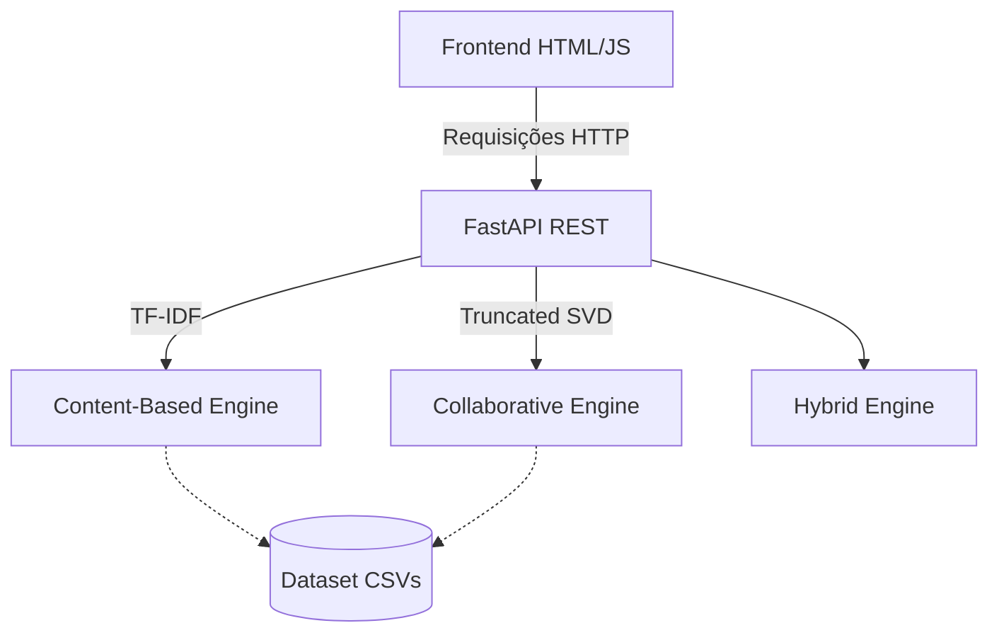

# 🎬 CineAI — Sistema Avançado de Recomendação de Filmes

<p align="center">
  
  
  
  
</p>

O **CineAI** é um sistema de recomendação de filmes inteligente que implementa três estratégias distintas: **Content-Based Filtering**, **Collaborative Filtering via SVD** e um **Recomendador Híbrido**. Construído sobre a robusta base de dados do *MovieLens*, ele conta com um backend veloz em FastAPI e uma interface web interativa.

---

## 📋 Índice

- [✨ Funcionalidades](#-funcionalidades)
- [🧠 Visão Geral e Algoritmos](#-visão-geral-e-algoritmos)
- [🛠️ Tecnologias](#️-tecnologias)
- [📂 Estrutura do Projeto](#-estrutura-do-projeto)
- [🚀 Instalação e Execução (Windows)](#-instalação-e-execução-windows)
- [🐧 Inicialização Manual (Linux / macOS)](#-inicialização-manual-linux--macos)
- [🌐 Endpoints da API](#-endpoints-da-api)
- [🏗️ Arquitetura](#️-arquitetura)
- [🤝 Como Contribuir](#-como-contribuir)

---

## ✨ Funcionalidades

- **Múltiplos Motores de Recomendação:** Escolha entre recomendações baseadas no perfil do filme, histórico do usuário, ou uma mescla dos dois.
- **Busca Rápida (Autocomplete):** Pesquise filmes rapidamente com uma API indexada.
- **Configuração Descomplicada:** Script `start.bat` para iniciar o projeto com dois cliques.
- **Escalável:** Testado e aprovado com uma base de dados de **~30 milhões de avaliações**.

---

## 🧠 Visão Geral e Algoritmos

O CineAI implementa as três principais abordagens da literatura de sistemas de recomendação:

| Estratégia | Base de Cálculo | Quando Usar |
|---|---|---|
| **Content-Based** | Gêneros + tags textuais via TF-IDF | Quando o usuário não possui histórico. Busca por similaridade de conteúdo e "clima" do filme. |
| **Collaborative Filtering** | Histórico de avaliações via Truncated SVD | Quando o usuário já possui histórico. Focado em descoberta de preferências latentes baseadas em usuários parecidos. |
| **Híbrido** | Combinação 50/50 normalizada | Excelente para recomendações gerais e de alta precisão. |

**Escala suportada pelo dataset MovieLens utilizado:**
- 🎬 87.585 filmes catalogados
- 👥 200.948 usuários únicos
- ⭐ ~30 milhões de classificações (*ratings*)

---

## 🛠️ Tecnologias

O projeto adota uma *stack* de processamento de dados e desenvolvimento backend moderna:

- **Linguagem:** Python 3.9+
- **API REST & Servidor:** FastAPI + Uvicorn
- **Manipulação de Dados:** Pandas & NumPy
- **Machine Learning & Matemática:** Scikit-learn & SciPy
- **Frontend:** Vanilla HTML, CSS e JavaScript

---

## 📂 Estrutura do Projeto

A arquitetura de pastas foi desenhada para separar claramente as camadas do software:

```text
cineai/
│
├── backend/
│   ├── api.py              ← API REST e core de recomendação
│   ├── Especialista.py     ← Script para testes e manipulação da lógica
│   └── requirements.txt    ← Lista de dependências do Python
│
├── frontend/
│   └── index.html          ← Interface de usuário (Painel Web)
│
├── dataset/
│   ├── movies.csv          ← Dados dos filmes (requer download)
│   ├── ratings.csv         ← Avaliações dos usuários (requer download)
│   ├── tags.csv            ← Metadados textuais (requer download)
│   ├── links.csv           ← IDs de correlação (requer download)
│   └── README.txt          ← Instruções de alocação de dados
│
├── start.bat               ← 🚀 Script de auto-inicialização (Windows)
├── .env.example            ← Modelo para variáveis de ambiente
└── README.md               ← Documentação principal
```

---

## 🚀 Instalação e Execução (Windows)

Automatizamos todo o processo para que você possa focar no que importa: usar a aplicação.

### 1. Clonando o Repositório

No seu terminal, execute:
```bash
git clone https://github.com/seu-usuario/cineai.git
cd cineai
```

### 2. Download do Dataset

Para evitar um repositório gigabyte, o banco de dados deve ser baixado de forma independente:
1. Acesse o portal [GroupLens](https://grouplens.org/datasets/movielens/).
2. Baixe a versão **ml-latest** (dataset completo).
3. Extraia os arquivos `movies.csv`, `ratings.csv`, `tags.csv` e `links.csv` diretamente para dentro da pasta `dataset/` no seu projeto.

> **Dica Pro (Opcional):** Prefere deixar os arquivos CSV em um HD externo ou outra pasta? Sem problemas! Crie um arquivo `.env` na raiz do projeto (use o `.env.example` de base) e preencha a variável `DATASET_PATH` com o caminho desejado.

### 3. A Mágica Acontece (`start.bat`)

Vá até a pasta raiz do projeto e dê **dois cliques no arquivo `start.bat`**.
O script irá automaticamente:
1. Verificar e instalar as bibliotecas (se necessário).
2. Iniciar o servidor FastAPI num terminal interativo.
3. Abrir o frontend no seu navegador principal.

> ⚠️ **Aviso de Carregamento:** O processamento de matrizes de 30 milhões de linhas leva cerca de 30-60 segundos na primeira execução. O painel web estará operacional assim que a mensagem `✅ Sistema pronto!` surgir no terminal preto.

---

## 🐧 Inicialização Manual (Linux / macOS)

Caso esteja num ecossistema Unix, execute manualmente:

```bash
# 1. Instale as dependências essenciais
pip install -r backend/requirements.txt

# 2. Suba o servidor backend
cd backend
uvicorn api:app --host 0.0.0.0 --port 8000
```
Com o servidor rodando, basta dar um duplo clique no arquivo `frontend/index.html` ou abri-lo pelo seu navegador favorito.

---

## 🌐 Endpoints da API

A documentação interativa Swagger/Redoc fica disponível em `http://localhost:8000/docs` assim que a aplicação sobe. Abaixo um resumo das rotas principais:

### Base URL: `http://localhost:8000`

- `GET /stats`  
  Retorna um snapshot JSON com métricas de volume da base de dados.
  
- `GET /search?q={termo}&limit={n}`  
  Endpoint leve para auto-complete de pesquisa por título de filmes.

- `GET /recommend/content?title={nome}&n={n}`  
  *Content-based filtering*. Traz recomendações puramente baseadas em análise textual (gêneros + tags) comparada ao filme pesquisado.

- `GET /recommend/collaborative?userId={id}&n={n}`  
  *Collaborative filtering*. Fornece recomendações baseadas nos padrões latentes descobertos via SVD para um usuário específico. *(Requer usuários com >20 avaliações)*.

- `GET /recommend/hybrid?title={nome}&userId={id}&n={n}`  
  O melhor dos dois mundos, ponderando 50% para conteúdo e 50% para a matriz colaborativa.

---

## 🏗️ Arquitetura

O sistema adota uma estrutura cliente-servidor leve:



*(As lógicas dos modelos residem em memória RAM da aplicação backend para prover latência mínima de requisição, carregando e vetorizando no evento de startup).*

---

## 🤝 Como Contribuir

Sinta-se livre para melhorar este projeto! Se você encontrar bugs, quiser otimizar o tempo de inicialização matricial, ou melhorar o layout web:
1. Faça um *Fork* do repositório
2. Crie uma branch para a sua feature (`git checkout -b feature/minha-feature`)
3. Faça o commit das mudanças (`git commit -m 'feat: adiciona nova feature'`)
4. Faça o Push (`git push origin feature/minha-feature`)
5. Abra um *Pull Request*

---

## 📄 Licença

O código-fonte deste projeto é de uso aberto. No entanto, atente-se à licença do **MovieLens Dataset**, que é disponibilizado pelo *GroupLens Research* exclusivamente para fins não-comerciais. Consulte as regras em [grouplens.org](https://grouplens.org/datasets/movielens/).

---
<p align="center">
  <i>Desenvolvido como projeto acadêmico — Engenharia da Computação · UNIFAN</i>
</p>
